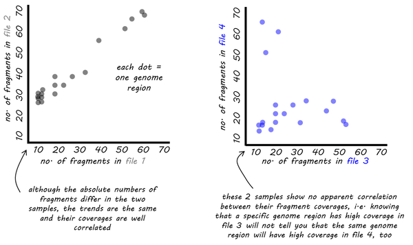
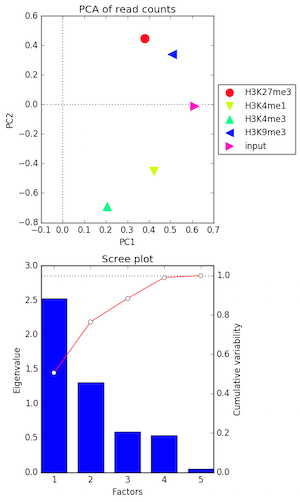
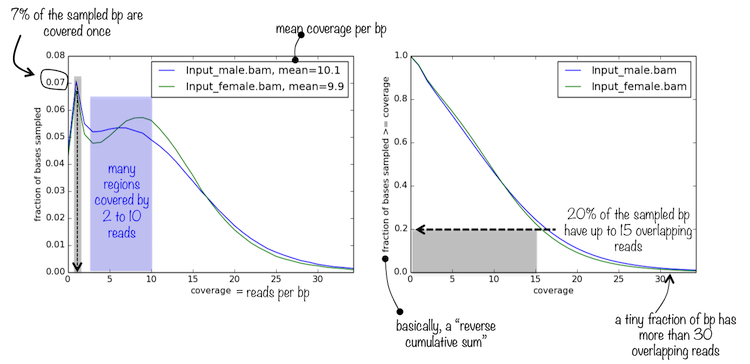
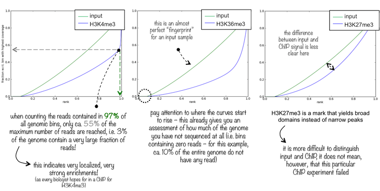

Contributors: Mary Piper

Approximate time: 1.5 hours

## Learning Objectives

* generate enrichment and quality measures for ChIP-Seq data
* assess the quality of alignments using coverage metrics and visualizations

# ChIP-Seq quality assessment

Prior to performing any analyses, it is best practice to assess the quality of your ChIP-Seq data for peak signal and alignment metrics. 

We will explore the *quality of the peaks* to determine the strength of the signal relative to noise and to ensure the fragment length is accurate based on the experimental design. Poor signal-to-noise and inaccurate fragment lengths can indicate problems with the ChIP-Seq data. 

For the *alignment quality*, we will investigate the read coverages for each sample and determine the variability in coverage per sample group. Replicate samples that vary greatly in where the reads stack up is indicative of a weak ChIP-Seq experiment. 
<Paragraph on importance of QC and what we are doing/looking for>

## Obtaining quality metrics using *phantompeakqualtools*

The *[phantompeakqualtools](https://code.google.com/archive/p/phantompeakqualtools/)* package allows for the generation of enrichment and quality measures for ChIP-Seq data [[1](http://www.g3journal.org/content/4/2/209.full)]. We will be using the package to compute the predominant insert-size (fragment length) based on strand cross-correlation peak and data quality measures based on relative phantom peak.

### Set up

The *phantompeakqualtools* package is written as an R script, `run_spp.R` that uses `samtools` as a dependency. The package has various options that can be specified when running from the command line. To get set up, we will need to start an interactive session, load the necessary modules and set up the directory structure:

```
$ bsub -Is -n 6 -q interactive bash

$ module load stats/R/3.2.1 seq/samtools/1.2

$ cd ~/ngs_course/chipseq/results

$ mkdir qc

$ cd qc
```
### Downloading *phantompeakqualtools*

To use this *phantompeakqualtools* package, we need to download it from the project website. On the [project website](https://code.google.com/archive/p/phantompeakqualtools/), click on the *Downloads* option on the left-hand side of the page. The *Downloads* page has all updates for the package, with the most recent being from 2013. 

Right-click on the link for the most recent update, and copy the link.

Download the *phantompeakqualtools* to your directory using `wget`:

```
$ wget https://storage.googleapis.com/google-code-archive-downloads/v2/code.google.com/phantompeakqualtools/ccQualityControl.v.1.1.tar.gz

$ ls
```

***NOTE:*** *You may be asked to choose a mirror. If so, just choose a location nearest to where you are located (i.e. in the northeast).*

You should see `ccQualityControl.v.1.1.tar.gz` appear in the folder. This is a compressed folder, to extract the contents we use the `tar -xzf` command:

```
$ tar -xzf ccQualityControl.v.1.1.tar.gz
```
The `tar` command offers a simple way to compress and uncompress entire directories. We are using the command to uncompress the `ccQualityControl.v.1.1.tar.gz` directory. 

The options included are:

`-x`: extract a tar archive (or tarball) file

`-z`: the file is a compressed gzip archive file

`-f`: file name of archive file (needs to preceed the file name)

***NOTE:*** *To compress a directory, you would issue the same command, but replace -x with -c, which specifies to create a new tar archive (or tarball) file, and after the name of the tar file you would name the directory to be compressed*

You should now see a `phantompeakqualtools` folder. Let's explore the contents a bit:

```
$ cd phantompeakqualtools

$ ls -l
```

Note the script for generating the quality metrics, `run_spp.R`. There should also be a `README.txt` which contains all the commands, options, and output descriptions. Let's check out the `README.txt`:

```
$ less README.txt
```

### Installing R libraries

We will need to install the R package, `caTools`, into our personal R library to run the script:

```
$ R
```

In R, use the install.packages() function to install `caTools`:

```
> install.packages("caTools", lib="~/R/library")

> quit()

```


### Running *phantompeakqualtools*

To obtain quality measures based on cross-correlation plots, we will be running the `run_spp.R` script from the command line. Options for the tools that we will include are:

* `-c`: full path and name (or URL) of tagAlign/BAM file
* `-savp`: save cross-correlation plot
* `-out`: will create and/or append to a file named several important characteristics of the dataset described in more detail below.

```
## DO NOT RUN THIS
$ Rscript run_spp.R -c=<tagAlign/BAMfile> -savp -out=<outFile>
```

From the `phantompeakqualtools` directory, run a 'for loop' to run the script on every Nanog and Pouf51 BAM file:

```
$ for bam in ../../bowtie2/*Nanog*aln.bam ../../bowtie2/*Pou5f1*aln.bam
do 
Rscript run_spp.R -c=$bam -savp -out=${bam}.qual > ${bam}.Rout
done

$ mkdir logs qual

$ mv ../../bowtie2/*Rout logs

$ mv -t qual ../../bowtie2/*qual ../../bowtie2/*pdf
```

To visualize the quality results (.qual) files more easily, we will concatenate the files together to create a single summary file that you can move over locally and open up with Excel.

```
$ cat qual/*qual > qual/phantompeaks_summary.qual
```
Let's use Filezilla or `scp` move the summary file over to our local machine for viewing.

#### Description of the quality information

The qual files are tab-delimited with the columns containing the following information:

- COL1: Filename: tagAlign/BAM filename 
- COL2: numReads: effective sequencing depth i.e. total number of mapped reads in input file 
- COL3: estFragLen: comma separated strand cross-correlation peak(s) in decreasing order of correlation. (**NOTE:** The top 3 local maxima locations that are within 90% of the maximum cross-correlation value are output. In almost all cases, the top (first) value in the list represents the predominant fragment length.) 
- COL4: corr_estFragLen: comma separated strand cross-correlation value(s) in decreasing order (col2 follows the same order) 
- COL5: phantomPeak: Read length/phantom peak strand shift 
- COL6: corr_phantomPeak: Correlation value at phantom peak 
- COL7: argmin_corr: strand shift at which cross-correlation is lowest 
- COL8: min_corr: minimum value of cross-correlation 
- COL9: Normalized strand cross-correlation coefficient (NSC) = COL4 / COL8 
- COL10: Relative strand cross-correlation coefficient (RSC) = (COL4 - COL8) / (COL6 - COL8) 
- COL11: QualityTag: Quality tag based on thresholded RSC (codes: -2:veryLow,-1:Low,0:Medium,1:High,2:veryHigh)

Three of the more important values to observe are the NSC, RSC and QualityTag values:

**NSC:** values range from a minimum of 1 to larger positive numbers. 1.1 is the critical threshold. Datasets with NSC values much less than 1.1 (< 1.05) tend to have low signal to noise or few peaks (this could be biological eg.a factor that truly binds only a few sites in a particular tissue type OR it could be due to poor quality)

**RSC:** values range from 0 to larger positive values. 1 is the critical threshold. RSC values significantly lower than 1 (< 0.8) tend to have low signal to noise. The low scores can be due to failed and poor quality ChIP, low read sequence quality and hence lots of mismappings, shallow sequencing depth (significantly below saturation) or a combination of these. Like the NSC, datasets with few binding sites (< 200) which is biologically justifiable also show low RSC scores.

**QualityTag:** A quick check of RSC, with negative values indicating poor signal to noise.

#### Cross-correlation plots

The cross-correlation plots show the best estimate for strand shift and the cross-correlation values. This file can be viewed by transferring it to your local machine using FileZilla. Copy `H1hesc_Nanog_Rep1_chr12_aln.pdf` to your machine to view the strand shift.

## Quality assessment using *deepTools*

Using the *[deepTools](http://deeptools.readthedocs.org/en/latest/content/list_of_tools.html)*, suite of tools, we can assess the quality of our alignments for each of our samples using several metrics.

Assessing and visualizing alignment quality using *deepTools* requires three steps: 

1. Indexing the BAM alignment files
2. Calculation of the read coverage scores using the `multiBamSummary` tool
3. Visualizing how read coverage scores compare between samples

### Indexing the BAM alignment files

Similar to this step in previous lessons, we will index our BAM files using the `samtools index` tool.

Since we loaded `samtools` to use the *phantompeakqualtools*, we do not need to load it again. Let's just create a `deeptools` directory within the `bowtie2` folder:

```
$ cd ~/ngs_course/chipseq/results/qc

$ mkdir deeptools 

$ cd deeptools

```

Then, we can index the BAM files by using the command: `samtools index path/to/bam`. 

Since we would like to index all of our BAM files containing uniquely mapping reads in the `bowtie2` folder, we can use a 'for loop' to index all files ending with `aln.bam`:

```
$ for bam in ../../bowtie2/*aln.bam
> do
> samtools index $bam
> done
```
Now we should have an index (BAI) file for each of our BAM files.

Let's load the module and we are ready to get started:

```
$ module load seq/deeptools/1.6.0 seq/deeptools/2.2.0
```

### Calculation of the read coverage scores using the `multiBamSummary` tool

The `multiBamSummary` tool will calculate the read coverage scores for specific genomic regions between samples and provide the output as a binary compressed numpy array (.npz) file. It will also output a `readCounts.tab` file that contains a list read counts per sample for every 10,000bp region in the genome. 

***NOTE:*** *The analysis can be performed on the entire genome by changing the mode of this tool to `bins`.*

```
$ multiBamSummary bins --ignoreDuplicates -p 6 \
--bamfiles ../../bowtie2/*aln.bam \
-out deeptools_multiBAM.out.npz \
--outRawCounts readCounts.tab
```

### Visualizing how read coverage quality metrics

Now that we have the read coverage scores calculated for all samples, we can now analyze the coverage between samples using a variety of the *deepTools* tools:

#### 1. Sample correlation - `plotCorrelation` tool

The `plotCorrelation` tool allows us to visualize the similarity between samples based on their read coverage of regions of the genome. For example, we can compare two samples to determine whether they have similar coverage profiles with either a heatmap or a scatterplot:



```
$ plotCorrelation --corData deeptools_multiBAM.out.npz \
--plotFile deepTools_scatterplot.png \
--corMethod pearson \
--whatToPlot scatterplot \
--labels Input_Rep1 Input_Rep2 Nanog_Rep1 Nanog_Rep2 Pou5f1_Rep1 Pou5f1_Rep2
```

The same `plotCorrelation` tool can be used to examine the  read coverage similarity using a heatmap to perform heirarchical clustering and determine whether our sample groups cluster well (i.e. have similar read coverage profiles within and between sample groups).

```
$ plotCorrelation --corData deeptools_multiBAM.out.npz \
--plotFile deeptools_heatmap.png \
--corMethod pearson \
--whatToPlot heatmap \
--labels Input_Rep1 Input_Rep2 Nanog_Rep1 Nanog_Rep2 Pou5f1_Rep1 Pou5f1_Rep2 \
--plotNumbers
```


#### 2. Sample variability - `plotPCA` tool

The next quality metric we will explore is the principal component analysis (PCA) of our read coverage calculations. PCA can be used to determine whether samples display greater variability between experimental conditions than between replicates of the same treatment based on information (read coverage values) from thousands of regions. PCA is also useful to identify unexpected patterns, such as those caused by batch effects or outliers. 

You will use the tool `plotPCA` to sort the principal components according to the amount of variability of the data that they explain and generate two plots:

- the PCA plot for the top two principal components eigenvalues 
- the Scree plot for the top five principal components where the bars represent the amount of variability explained by the individual factors and the red line traces the amount of variability is explained by the individual components in a cumulative manner [[1]](http://deeptools.readthedocs.org/en/latest/content/tools/plotPCA.html)



```
$ plotPCA --corData deeptools_multiBAM.out.npz \
--plotFile deepTools_pcaplot.png \
-T "PCA of read counts" \
--outFileNameData pcaProfile.tab \
--labels Input_Rep1 Input_Rep2 Nanog_Rep1 Nanog_Rep2 Pou5f1_Rep1 Pou5f1_Rep2
```
#### 3. Sample sequencing depth - `plotCoverage` tool

The `plotCoverage` tool will generate plots to explore the average number of reads per base pair in the genome. The tool will generate two plots, giving the frequencies of read coverage and the fraction of bases versus read coverage.



```
$ plotCoverage --bamfiles ../../bowtie2/*aln.bam \
--ignoreDuplicates \
-o deepTools_coverageplots.png \
--labels Input_Rep1 Input_Rep2 Nanog_Rep1 Nanog_Rep2 Pou5f1_Rep1 Pou5f1_Rep2
```
#### 4. Sample signal strength - `plotFingerprints` tool

The `plotFingerprints` tool "determines how well the signal in the ChIP-seq sample can be differentiated from the background distribution of reads in the control sample" [[2](http://deeptools.readthedocs.org/en/latest/content/tools/plotFingerprint.html)].  

"For factors that will enrich well-defined, rather narrow regions (e.g. transcription factors such as p300), the resulting plot can be used to assess the strength of a ChIP, but the broader the enrichments are to be expected, the less clear the plot will be" [[2](http://deeptools.readthedocs.org/en/latest/content/tools/plotFingerprint.html)].

The tool will generate a plot for the cumulative read coverages for each sample.



***
*This lesson has been developed by members of the teaching team at the [Harvard Chan Bioinformatics Core (HBC)](http://bioinformatics.sph.harvard.edu/). These are open access materials distributed under the terms of the [Creative Commons Attribution license](https://creativecommons.org/licenses/by/4.0/) (CC BY 4.0), which permits unrestricted use, distribution, and reproduction in any medium, provided the original author and source are credited.*

